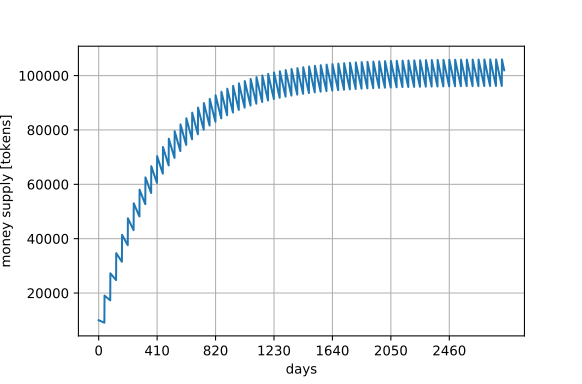

# Demurrage

Encointer currencies feature [nominal demurrage](https://en.wikipedia.org/wiki/Demurrage_(currency)): All balances get devalued over time. The funds you’re holding lose 7% of their nominal value every month. Think of this devaluation like a payment to a solidarity fund that pays for the UBI. This way, Encointer can issue monthly UBI and still maintain stable money supply as shown by the simulation in the figure below. Another advantage of demurrage has been described by [Silvio Gesell](https://en.wikipedia.org/wiki/Silvio_Gesell) when he proposed [Freigeld](https://en.wikipedia.org/wiki/Freigeld) in 1916: Demurrage increases money velocity, which in turn fuels the local economy.

*Money supply for a stationary economy with a demurrage fee of 7% per month and a population of 10’000 participants. After an initial phase, the UBI of 1 token per ceremony maintains a constant ratio to the total money supply and therefore maintains a constant real value.*

## Comparison

Demurrage is mainly known as a means to increase money velocity. Known [local currencies](economics-local-currencies.md) have chosen demurrage to be in the range of 2-8% per year.

Due to technical limitations, demurrage is often charged linearly, like 2% of the face value per quarter as in the case Chiemgauer, where demurrage is applied by stamping paper bills. Encointer has more technical freedom and charges *compound* demurrage, as a percentage of its current value. The difference between linear and compound demurrage becomes clear after 50 quarters: Your 100 Chiemgauer have cost 100€ in demurrage fees. With compound demurrage, your 100 Chiemgauer would still be worth

100€ * (1-0.02)^50 = 36.42€
