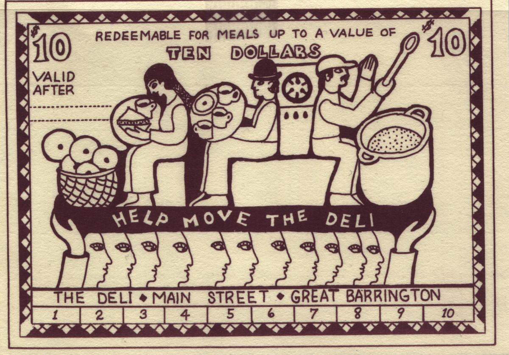

# On Saving, Loans and Interest

> If you ask me what is the worst thing in the world, I will say it is compound interest

said Olusegun Obasanjo, president of Nigeria, in August 2000 after the G8 Okinawa summit.

> All that we had borrowed up to 1985 or 1986 was around $5 billion and we have paid about $16 billion yet we are still being told that we owe about $28 billion. That $28 billion came about because of the injustice in the foreign creditors’ interest rates.

Compound interest makes debt grow exponentially, but nothing in nature grows exponentially forever. Sooner or later there will always be a saturation effect (usually modeled with an [S-curve](https://en.wikipedia.org/wiki/S-curve_(math))).

Even worse, our national money is *created* by commercial banks as credit, bearing compound interest. A priviledge for wealthy shareholders, which results in constantly growing debt and [growth imperative](https://en.wikipedia.org/wiki/Growth_imperative#Monetary_system_and_the_role_of_positive_interest_rates), an unsustainable way to design our economy.

Compound interest is also a major cause of inequality [1]. It ensures that rich are getting richer while the poor are getting poorer.

## Alternatives

A Lender usually charges interest from the borrower. Besides giving the borrower an income, interest also covers opportunity costs and compensates for the risk of the borrower defaulting on the loan.

It is beneficial to society if members with capital they can spare for a limited period of time provide their assets to members who need capital to build a business or suffer a temporary shortage.

In a society with a lot of social capital, lenders often provide their assets without a monetary incentive (or do you charge interest when borrowing money to a friend?). But this way of social lending does not scale well to larger loans.

Mutual credit is a way to better scale social credit beyond bilateral agreements (See WIR, LETS, RES). Interest-free credit is issued by clearing positive and negative balances when members trade, denominated in national currency. (See [local currencies](./economics-local-currencies.md))

## Saving Is No Virtue

One of the main reasons we're saving is the fear that we might not be able to cover for our needs at some point in the future. UBI addresses this fear by promising a minimal unconditional income until our death. Insurance is another answer to this fear.

The act of accumulating capital is considered a main reason for the [growth imperative](https://en.wikipedia.org/wiki/Growth_imperative#Monetary_system_and_the_role_of_positive_interest_rates) by [2]. 

Saving is also motivated by the desire to become wealthy and better off than others. This desire conflicts with Encointer's goals of reducing inequality.

For all these reasons, the design of Encointer disincentivizes saving in favor of spending or investing locally.

## Encointer's Approach

Holding Encointer currencies comes at high opportunity costs because of [demurrage](./economics-demurrage.md). This is an incentive to spend or lend money at no interest. However, it may appear more attractive to exchange all perishable money you don't immediately need for other assets outside the encointer ecosystem (national currency, shares, bonds, crypto assets). This investor flight would decrease the real value of encointer currencies.

Encointer allows businesses the issuance of vouchers that are not subject to demurrage. Vouchers are a transferrable promise to deliver goods or services sometime in the future. If they are transferrable, vouchers are nothing less than self-issued money. Vouchers can be *valid after* a certain date and therefore become credit. This credit is paid back by goods and services, not by money.

The [story of the *Deli Dollar*](https://www.independent.co.uk/news/business/delidollar-offers-route-to-business-funding-1071370.html) tells us how vouchers can be credit:

> Frank Tortoriello runs a deli in Great Barrington, Massachusetts. In 1989 he wanted to move to larger premises but the bank would not lend him the $4,500 he needed, so he simply printed his own money.
> He did not forge dollar bills - he launched "deli dollars" which customers could buy for $8 and, at phased periods, cash in for $10 of food. He sold the lot in a month and raised $5,000. 

With these vouchers, investors pay 8$ today instead of 10$ at some defined point in the future. This discount pleases the human [time preference](https://en.wikipedia.org/wiki/Time_preference). While this discount can be viewed as interest, it certainly isn't compound interest. It only applies once and its value is fixed. Still, it gives the investor an incentive to invest.

## References

[1](https://link.springer.com/article/10.1007/s11403-019-00236-7) *Biondi et al, Inequality, mobility and the financial accumulation process: a computational economic analysis, Journal of Economic Interaction and Coordination, 2019*

[2](https://www.mathias-binswanger.ch/index.php/books/274-derwachstumszwang) *Binswanger, Mathias (2019). Der Wachstumszwang: Warum die Volkswirtschaft immer weiterwachsen muss, selbst wenn wir genug haben. Wiley-CVH. p. 275. ISBN 978-3-527-50975-1.*